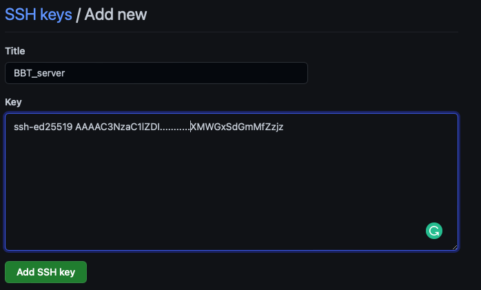

## What is an SSH key?

To be able to make changes to a remote repository when working from your account on the server you need to set up an ssh key for this client. An SSH key is a form of authenticating much like a password. However, SSH keys are much more convenient and secure than regular passwords. For more information visit [about-ssh](https://docs.github.com/en/authentication/connecting-to-github-with-ssh/about-ssh).

## Setting up an SSH key for your server account

To set up an ssh key for your account on the server you need to first log in to your account.

```markdown
$ ssh <user_name@13.48.179.168
```
Once logged in you need to generate the ssh key.
```markdown 
$ ssh-keygen -t ed25519
```

This will create two new files in the directory .ssh. The file id_ed25519 contains your private key while id_ed25519.pub contains the public key.


You will then be prompted to enter a location to store the ssh key. Just press enter to store it in the default location.
```markdown
> Enter a file in which to save the key (/home/you/.ssh/algorithm): [Press enter]
```
Then you will be prompted to add a passphrase, you can either skip this by pressing enter or type in a passphrase/password that you'll use along with your ssh-key. Passphrases are an additional security layer that prevents anyone with access to your account from also using your ssh-keys to get further access to other services.

```makdown
> Enter passphrase (empty for no passphrase): [Type a passphrase]
> Enter same passphrase again: [Type passphrase again] 
```
```markdown
$ ls .ssh
> id_ed25519  id_ed25519.pub 
```
Next, we need to start an ssh-agent that will manage our keys.

```makdown
$ eval "$(ssh-agent -s)"
> pid xxxxx
$ ssh-add ~/.ssh/id_ed25519
```

Finally, we need to add the public key (.ssh/id_ed25519.pub) that we generated to our GitHub account. When logged in to GitHub navigate to settings then to SSH and GPG keys. Press the new SSH key button, give this ssh key a descriptive title so that you know where this key is linked to. You can view your key with the command cat and copy it to your clip-board and then paste it in.

```markedown
$ cat ~/.ssh/id_ed25519.pub
> ssh-ed25519 AAAAC3NzaC1lZDI..........XMWGxSdGmMfZzjz sandra@ip-172-31-41-241
```



## Setting up an SSH key for your pc/mac

To set up your ssh key on your own computer you can use the same steps you used for the server. However, you should first check if you already have an existing key. You can check for existing keys with.

```markdown
$ ls -al ~/.ssh
```
If you have an existing key with any of the following formats
* id_rsa.pub
* id_ecdsa.pub
* id_ed25519.pub

you can choose to upload that to Github and add it to the ssh-agent as before.

## Test your SSH conection to github

You can test that you have done everything correctly by running the command.

```markdown
ssh -T git@github.com
```
You will then get prompted you should answer yes and enter.

```markdown
The authenticity of host 'github.com (140.82.121.4)' can't be established.
ECDSA key fingerprint is SHA256:p2QAMXNIC1TJYWeIOttrVc98/R1BUFWu3/LiyKgUfQM.
Are you sure you want to continue connecting (yes/no/[fingerprint])? yes
```
Then you will get a message that informs you that you have You've successfully authenticated your connection.
