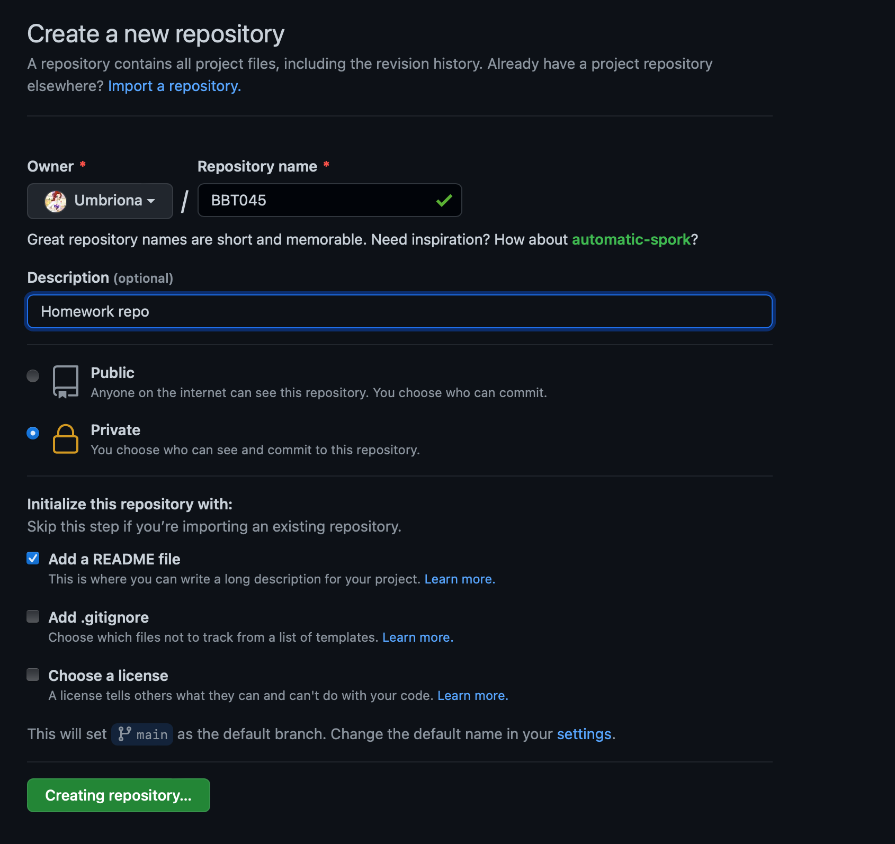
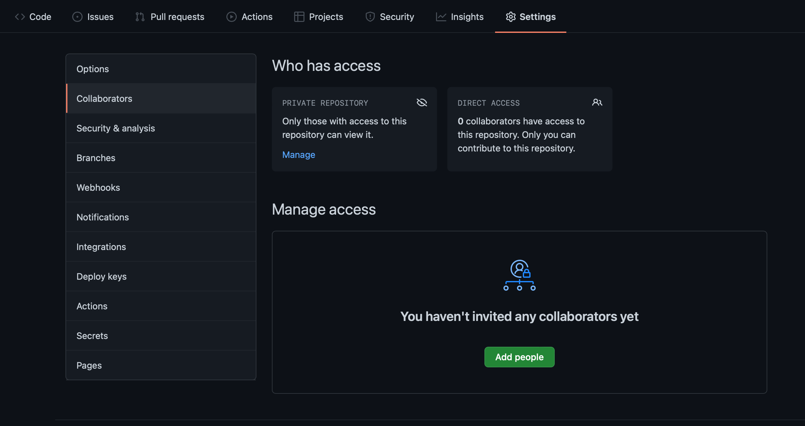
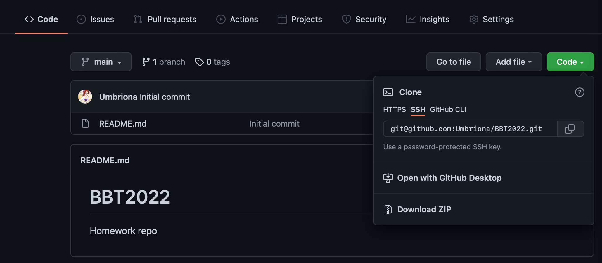

## Homework on github

When doing your home work you should primarily be working on the server. Git and GitHub will not get it's own explicit assignment, instead you will be keeping all your assignments in a version control repo and upload to GitHub. The link to this repo will then be submitted along with the report for each homework on canvas.

## Create Repo 

To initialize your homework repo log on to your github account and navigate to your repositories. Click new, and create a private repository called BBT045 Homework or something similar. Make sure to to click add README. 



Then navigate to your new homework repo and go to settings and Collaborators. Click add people and add Umbriona (Sandra) and alzel (Aleksej). 



## Clone Repo

When you are done adding us as collaborators go back to the Code tab. Click the button that says code and copy the link that has the .git extension to your clip board.



You should now clone the remote repo that we just created to your server by running the following command from the home directory on the server. 

```markdown
$ git clone git@github.com:<your repo>.git
```

This will make a clone of the repo on the server with all the history and files. Running the command ls in your home directory you will see that it now contains a new directory named as your repo. If you cd in to this directory you can see that it also contains the REDME.md file. 

Finally we want to make new directories in our repo for each of the four homework (HW1 ... HW4). When these are made we can stage our changes and commit them with an appropriate message. To uppdate the remote repository we then just need to run git push.

```markdown
$ cd <your repo>
$ ls
> README.md
$ mkdir HW1 HW2 HW3 HW4
$ git add HW1 HW2 HW3 HW4
$ git commit -m "Creating HW directories"
$ git push
```
