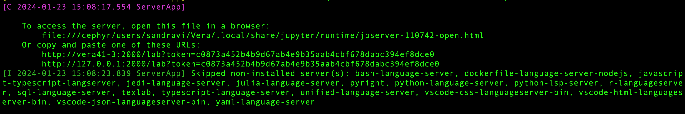
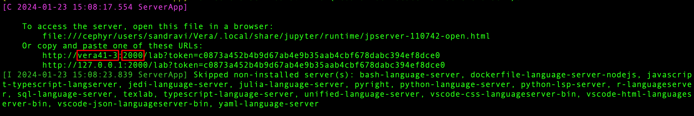
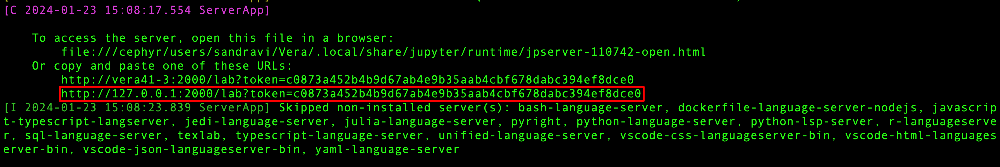

# Start Jupyter Lab session from server

To initiate a Jupyter Lab session on the cluster, follow these steps:

## Log in to the Cluster
Begin by logging into the cluster using the following command, replacing <cid> with your user ID:

`ssh <cid>@vera1.c3se.chalmers.se`

## 2. Copy the Jupyter Lab Script
Copy the run_jupyter.sh script to your desired working directory using the cp command. Adjust <your_directory> accordingly.

`cp /cephyr/NOBACKUP/groups/bbt045_2024/Container/run_jupyter.sh ./<your_directory>`

## 3. Edit Script Parameters

Open the run_jupyter.sh file and edit the lines:

`ID=0                 # Replace 0 with your ID number`\
`TIME=00:20:00        # Adjust the time requirements as needed`

## 4. Run the Script
Execute the edited script to allocate resources on the cluster.

`./run_jupyter.sh`

## 5. Note Your Assigned Node and Port

After a brief moment, you will be allocated resources. Take note of the assigned node and port from the displayed information.

## 6. Connect to Jupyter Lab Locally
Open a **new Terminal on your local machine** and use the following ssh command to connect to the Jupyter Lab session. Adjust <port> and <node_name> based on your assigned values.

`ssh -N -L <port>:<node_name>:<port> <cid>@vera1.c3se.chalmers.se`. 

In our example:
`ssh -N -L 2000:vera41-3:2000 <cid>@vera1.c3se.chalmers.se`.  

## 7. Open Jupyter Lab in Your Browser
Paste the provided link in your browser to access the Jupyter Lab session.

Now you are ready to start working in Jupyter Lab on the cluster!

