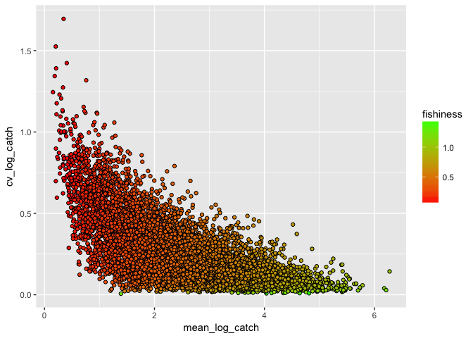

## Overview  

> Data scientists, according to interviews and expert estimates, spend from 50 percent to 80 percent of their time mired in the mundane labor of collecting and preparing data, before it can be explored for useful information. - [NYTimes (2014)](http://www.nytimes.com/2014/08/18/technology/for-big-data-scientists-hurdle-to-insights-is-janitor-work.html)

> "Happy families are all alike; every unhappy family is unhappy in its
> own way." --– Leo Tolstoy

> "Tidy datasets are all alike, but every messy dataset is messy in its
> own way." --– Hadley Wickham


This tutorial will cover the `tidyr` and `dplyr` packages created by the mythical code wizard [Hadley Wickham](https://github.com/hadley) of `ggplot2` fame. The "gg" in `ggplot2` stands for the "grammar of graphics". Hadley similarly considers the functionality of the two packages `dplyr` and `tidyr` to provide the "grammar of data manipulation". The following topics will be covered:

### Resources  

- [Data wrangling cheatsheet (`dplyr`,`tidyr`)](http://ucsb-bren.github.io/refs/cheatsheets/data-wrangling-cheatsheet.pdf)
- [Data wrangling with R and RStudio](https://www.rstudio.com/resources/webinars/data-wrangling-with-r-and-rstudio/)
- [dplyr vignette: Introduction to dplyr](https://cran.rstudio.com/web/packages/dplyr/vignettes/introduction.html)
- [Window functions and grouped mutate/filter](https://cran.rstudio.com/web/packages/dplyr/vignettes/window-functions.html)
- [Databases](https://cran.rstudio.com/web/packages/dplyr/vignettes/databases.html)
- [Non-standard evaluation](https://cran.rstudio.com/web/packages/dplyr/vignettes/nse.html)
- [tidyr vignette: Tidy data](https://cran.r-project.org/web/packages/tidyr/vignettes/tidy-data.html)
- [Introduction to dplyr for Faster Data Manipulation in R](https://rpubs.com/justmarkham/dplyr-tutorial)
- [Cheat sheeet](https://www.rstudio.com/resources/cheatsheets/)
- [r4ds](https://r4ds.had.co.nz/)

### Getting Started  

You can [download RStudio](https://www.rstudio.com/products/rstudio/download/) if you don't have latest version `1.1.456` (menu RStudio -> About RStudio), which has many nice additions for running R chunks and providing table of contents in Rmarkdown documents.  

Install and/or load the following packages:


```r
## Install packages if needed
# install.packages('devtools')
# install.packages('tidyverse')
# Load packages
library(tidyverse)
# Check package versions after Packages pane -> Update
devtools::session_info()
```

### Why use dplyr and tidyr?
1. **Speed** - tidyverse packages are *really* fast  
2. **Readability** - the code syntax is straightforward and easy to read  
3. **Chaining** - *never break the chain*. More on this later  
4. **Integrates with ggplot2** - plot your data in the same workflow that you manipulate it with
5. **Can be used to analyze external databases without knowledge of additional database query languages** 


## Basics of dplyr and tidyr  
### Data frames and data tables
Although technically two separate packages, **dplyr** and **tidyr** were designed to work together and can basically be thought of as a single package. They are designed to work with data frames as is, but it is generally a good idea to convert your data to table data using the `read_csv()` or `tbl_df()` functions, particularly when working with large datasets. Now all are part of **tidyverse** packages.


```r
## Comparing read.csv with read_csv
# Read in FAO data
fao   <- read.csv(file = 'data/FAO_1950to2012_111914.csv', stringsAsFactors = F) 
summary(fao)
head(fao)
# vs using read_csv
fao   <- read_csv(file = 'data/FAO_1950to2012_111914.csv') 
```

```
## Warning: Duplicated column names deduplicated: 'Species (ISSCAAP group)'
## => 'Species (ISSCAAP group)_1' [4], 'Species (ASFIS species)' => 'Species
## (ASFIS species)_1' [5], 'Species (ASFIS species)' => 'Species (ASFIS
## species)_2' [6]
```

```
## Parsed with column specification:
## cols(
##   .default = col_character(),
##   `Species (ISSCAAP group)` = col_integer(),
##   `Fishing area (FAO major fishing area)` = col_integer()
## )
```

```
## See spec(...) for full column specifications.
```

```r
fao
# note: read_csv like read.csv(...)
#       also keeps original column names and converts to tbl_df()
names(fao) = make.names(names(fao), unique=T) # since original column names have duplicates

## Consider what happens with the following command
# fao # all entries are printed in your console
head(fao) # top five entries are printed in your console, columns wrap and can be difficult to follow if working with many variables
summary(fao)

## With dplyr
fao<-tbl_df(fao) # convert to table data
fao # now top 10 rows are shown along with data type of each variable. Variables that do not fit in console window are shown below.
glimpse(fao) # view all columns 
summary(fao)
if (interactive()) View(fao) # interactive==T if in Console, not knitting
```
### Resources  

- [Data import] (https://github.com/rstudio/cheatsheets/raw/master/data-import.pdf)


### Tidy data
In general, it is good practice to have your data organized in a "tidy" format.  

In tidy data: 

* Each variable forms a column  
* Each observation forms a row  
* Each type of observational unit forms a table  

  

### Data tranformation/main verbs of the 
Tidyr and dplyr are designed to help manipulate data sets, allowing you to convert between *wide* and *long* formats, fill in missing values and combinations, separate or merge multiple columns, rename and create new variables, and summarize data according to grouping variables. 

### Resources  

- [Data transformation](https://r4ds.had.co.nz/transform.html)


Dplyr and tidyr rely on the following main verbs:  

* Tidyr
+ `gather()` and `spread()` convert data between wide and long format  
+ `separate()` and `unite()` separate a single column into multiple columns and vice versa  
+ `complete()` turns implicit missing values in explicit missing values by completing missing data combinations

* Dplyr
+ `filter()` subset data based on logical criteria  
+ `select()` select certain columns  
+ `arrange()` order rows by value of a column  
+ `rename()` rename columns  
+ `group_by()` group data by common variables for performing calculations  
+ `mutate()` create a new variable/column  
+ `summarize()` summarize data into a single row of values  

Note that *unquoted* variable names are used by default in tidyr and dplyr functions. 

We'll use these verbs to process the raw FAO landings data into a more manageable tidy format.    

## Spreading and gathering

The principles of tidy data seem so obvious that you might wonder if you'll ever encounter a dataset that isn't tidy. Unfortunately, however, most data that you will encounter will be untidy. There are two main reasons:

1.  Most people aren't familiar with the principles of tidy data, and it's hard
    to derive them yourself unless you spend a _lot_ of time working with data.
    
1.  Data is often organised to facilitate some use other than analysis. For 
    example, data is often organised to make entry as easy as possible.
    
This means for most real analyses, you'll need to do some tidying. The first step is always to figure out what the variables and observations are. Sometimes this is easy; other times you'll need to consult with the people who originally generated the data. 
The second step is to resolve one of two common problems:

1. One variable might be spread across multiple columns.

1. One observation might be scattered across multiple rows.

Typically a dataset will only suffer from one of these problems; it'll only suffer from both if you're really unlucky! To fix these problems, you'll need the two most important functions in tidyr: `gather()` and `spread()`.

### Gathering

A common problem is a dataset where some of the column names are not names of variables, but _values_ of a variable. Take `table4a`: the column names `1999` and `2000` represent values of the `year` variable, and each row represents two observations, not one.


```r
table4a
```

```
## # A tibble: 3 x 3
##   country     `1999` `2000`
## * <chr>        <int>  <int>
## 1 Afghanistan    745   2666
## 2 Brazil       37737  80488
## 3 China       212258 213766
```

To tidy a dataset like this, we need to __gather__ those columns into a new pair of variables. To describe that operation we need three parameters:

* The set of columns that represent values, not variables. In this example, 
  those are the columns `1999` and `2000`.

* The name of the variable whose values form the column names. I call that
  the `key`, and here it is `year`.

* The name of the variable whose values are spread over the cells. I call 
  that `value`, and here it's the number of `cases`.
  
Together those parameters generate the call to `gather()`:


```r
table4a %>% 
  gather(`1999`, `2000`, key = "year", value = "cases")
```

```
## # A tibble: 6 x 3
##   country     year   cases
##   <chr>       <chr>  <int>
## 1 Afghanistan 1999     745
## 2 Brazil      1999   37737
## 3 China       1999  212258
## 4 Afghanistan 2000    2666
## 5 Brazil      2000   80488
## 6 China       2000  213766
```

The columns to gather are specified with `dplyr::select()` style notation. Here there are only two columns, so we list them individually. Note that "1999" and "2000" are non-syntactic names (because they don't start with a letter) so we have to surround them in backticks. To refresh your memory of the other ways to select columns, see [select](#select).

<div class="figure">

<p class="caption">Gathering `table4` into a tidy form.</p>
</div>

In the final result, the gathered columns are dropped, and we get new `key` and `value` columns. Otherwise, the relationships between the original variables are preserved. Visually, this is shown in Figure \@ref(fig:tidy-gather). We can use `gather()` to tidy `table4b` in a similar fashion. The only difference is the variable stored in the cell values:


```r
table4b %>% 
  gather(`1999`, `2000`, key = "year", value = "population")
```

```
## # A tibble: 6 x 3
##   country     year  population
##   <chr>       <chr>      <int>
## 1 Afghanistan 1999    19987071
## 2 Brazil      1999   172006362
## 3 China       1999  1272915272
## 4 Afghanistan 2000    20595360
## 5 Brazil      2000   174504898
## 6 China       2000  1280428583
```

To combine the tidied versions of `table4a` and `table4b` into a single tibble, we need to use `dplyr::left_join()`, which you'll learn about in [relational data].


```r
tidy4a <- table4a %>% 
  gather(`1999`, `2000`, key = "year", value = "cases")
tidy4b <- table4b %>% 
  gather(`1999`, `2000`, key = "year", value = "population")
left_join(tidy4a, tidy4b)
```

```
## Joining, by = c("country", "year")
```

```
## # A tibble: 6 x 4
##   country     year   cases population
##   <chr>       <chr>  <int>      <int>
## 1 Afghanistan 1999     745   19987071
## 2 Brazil      1999   37737  172006362
## 3 China       1999  212258 1272915272
## 4 Afghanistan 2000    2666   20595360
## 5 Brazil      2000   80488  174504898
## 6 China       2000  213766 1280428583
```

### Spreading

Spreading is the opposite of gathering. You use it when an observation is scattered across multiple rows. For example, take `table2`: an observation is a country in a year, but each observation is spread across two rows.


```r
table2
```

```
## # A tibble: 12 x 4
##    country      year type            count
##    <chr>       <int> <chr>           <int>
##  1 Afghanistan  1999 cases             745
##  2 Afghanistan  1999 population   19987071
##  3 Afghanistan  2000 cases            2666
##  4 Afghanistan  2000 population   20595360
##  5 Brazil       1999 cases           37737
##  6 Brazil       1999 population  172006362
##  7 Brazil       2000 cases           80488
##  8 Brazil       2000 population  174504898
##  9 China        1999 cases          212258
## 10 China        1999 population 1272915272
## 11 China        2000 cases          213766
## 12 China        2000 population 1280428583
```

To tidy this up, we first analyse the representation in similar way to `gather()`. This time, however, we only need two parameters:

* The column that contains variable names, the `key` column. Here, it's 
  `type`.

* The column that contains values from multiple variables, the `value`
  column. Here it's `count`.

Once we've figured that out, we can use `spread()`, as shown programmatically below, and visually in Figure \@ref(fig:tidy-spread).


```r
table2 %>%
    spread(key = type, value = count)
```

```
## # A tibble: 6 x 4
##   country      year  cases population
##   <chr>       <int>  <int>      <int>
## 1 Afghanistan  1999    745   19987071
## 2 Afghanistan  2000   2666   20595360
## 3 Brazil       1999  37737  172006362
## 4 Brazil       2000  80488  174504898
## 5 China        1999 212258 1272915272
## 6 China        2000 213766 1280428583
```

<div class="figure">

<p class="caption">Spreading `table2` makes it tidy</p>
</div>

As you might have guessed from the common `key` and `value` arguments, `spread()` and `gather()` are complements. `gather()` makes wide tables narrower and longer; `spread()` makes long tables shorter and wider.


#### More on Gather and Spread


First let's convert the FAO data from the current wide format to a long format.

```r
# Let's convert the fao data from it's current wide format to a long format using gather(). Note the use of helper fnc
d <- gather(fao, key='Year', value='Catch', num_range('X',1950:2012)) # ?select for num_range()

# We can convert back to wide format with the spread function by calling the previously created variables
spread(d,Year, Catch)

if (interactive()) View(d) # interactive==T if in Console, not knitting
# to handle: '-','...',' F','X'
```


#### Rename  
Now let's rename the columns to more manageable names (syntax is *new name* = *old name*)

```r
# Note the use of backticks around column names with special characters like "("
d <- dplyr::rename(d,
          country     = Country..Country.,
          commname    = Species..ASFIS.species.,
          sciname     = Species..ASFIS.species._2,
          spcode      = Species..ASFIS.species._1,
          spgroup     = Species..ISSCAAP.group.,
          spgroupname = Species..ISSCAAP.group._1,
          regionfao   = Fishing.area..FAO.major.fishing.area.,
          unit        = Measure..Measure.,
          year        = Year,catch=Catch)
```


#### Select  
Remove unwanted columns and observations.  

```r
# we could chose all the columns to keep
select(d,country, commname, sciname, spcode, spgroupname, regionfao, year, catch)

# but it's easier to just specify the columns to get rid of
d<-select(d,-spgroup,-unit)
```

There are also a number of **helper functions** that can be used in conjunction with `select()` to let you select without individually listing all those you wish to keep or drop. We used a helper function previously in our `gather()` function and now we'll try a few others.  

```r
# select all coloumns that begin with the letter s
select(d, starts_with('s'))

# select columns that match a regular expression
select(d, matches('*name'))

# select columns between two columns by referencing their position like normal [,x:y] syntax 
select(d, country, spcode:year)

# select every column (though I haven't found a situation where this is useful yet...)
select(d,everything())
```


#### Arrange  
Arrange entries by country, scientific name, fao region and year. You can use `desc()` within `arrange()` to control which variables you want to order in ascending or descending fashion 

```r
# arrange by country, sciname, regionfao, and year
d<-arrange(d,country,sciname,regionfao,year)
```

```
## Warning: package 'bindrcpp' was built under R version 3.4.4
```

```r
# if we'd like the years to be descending
arrange(d, country, desc(sciname), regionfao, desc(year))

# if we want to first order by species
arrange(d, sciname, country, regionfao, year)
```


#### Mutate  
Mutate can be used to edit existing variables or create new ones.

```r
d <- mutate(d,
            year      = as.numeric(str_replace(year, 'X', '')), # strip X off all year values and convert to numeric
            catch     = as.numeric(str_replace(catch, c(' F','...','-'), replacement = '')),
            logcatch  = log10(catch)) # create a  new variable of log catch
```


#### Filter  
Remove unwanted rows/observations.

```r
# remove the "Totals" values and any years with NA catch values
d<-filter(d,!(country %in% c('Totals - Quantity (number)','Totals - Quantity (tonnes)')) & !is.na(catch))

# print data
d
```


### Piping and chaining code
While the above workflow is perfectly acceptable, dplyr allows you to use the *pipe* (`%>%`) operator to *chain* functions together. Chaining code allows you to streamline your workflow and make it easier to read.

When using the `%>%` operator, first specify the data frame that all following functions will use. For the rest of the chain the data frame argument can be omitted from the remaining functions.

Now consider the same process as before only using pipes and a single dplyr chain:


```r
d <- fao %>%
  gather(key='Year',value = 'Catch',num_range('X',1950:2012)) %>% # convert to long format
  rename(
    country     = Country..Country., # rename columns
    #country     = `Country (Country)`, # backtick trick!
    commname    = Species..ASFIS.species.,
    spcode      = Species..ASFIS.species._1,
    sciname     = Species..ASFIS.species._2,
    spgroup     = Species..ISSCAAP.group.,
    spgroupname = Species..ISSCAAP.group._1,
    regionfao   = Fishing.area..FAO.major.fishing.area.,
    unit        = Measure..Measure.,
    year        = Year,
    catch       = Catch) %>%
  select(-spgroup,-unit) %>% # drop spgroup, regionfaoname, and unit variables
  arrange(country,sciname,regionfao,year) %>% # order by country, sciname, regionfao, and year
  mutate(
    year        = as.numeric(str_replace(year, 'X', '')), # strip X off all year values and convert to numeric
    catch       = as.numeric(gsub(catch, pattern=c(' F'), replacement = '', fixed = T)),
    logcatch    = log10(catch)) %>% # create a  new variable of log catch 
  filter(!country %in% c('Totals - Quantity (number)','Totals - Quantity (tonnes)') & !is.na(catch)) # remove 'Totals' rows - rows: 1,114,596 -> 310,619
```

```
## Warning in evalq(as.numeric(gsub(catch, pattern = c(" F"), replacement =
## "", : NAs introduced by coercion
```

```r
# print data frame
d
```

By chaining our code we were able to reproduce the same data frame without the need to continually overwrite it, and we can easily read each step in the process by observing the different verbs. We also only needed to reference the original data frame (fao) at the beginning of the chain rather than in each function call.


#### Complete  
Now our data is nice and tidy, but we realize that we actually want to retain NA values for years with missing catch data. We could just go back and remove the second argument from our `filter()` function. Or we could use the nifty `complete()` function to add in the missing combinations.  


```r
d %>%
  complete(year = 1950:2012)

d %>%
  group_by(country,sciname,commname,regionfao,spgroupname,spcode) %>%
  complete(year = 1950:2012) %>%
  ungroup()
```


#### Separate and Unite  
The `df$spcode` variable actually consists of 5 individual parts. 


We decide we want to create a new column for each taxonomic division of the spcode. We can accomplish this with `separate()` and undue it with `unite()`

```r
# create new variables for each taxonomic component 
d<-separate(d,spcode, into = c('maintaxa','order','family','genus','species'), sep = c(2,4,6,9))

# recombine the columns with unite 
d<-unite(d, col = spcode, maintaxa:species, sep = '') # Note - we can use helper functions here if needed
```


### Joins

- [Relational data](https://r4ds.had.co.nz/relational-data.html)


So far we've been working with a single data frame, but dplyr provides a handful of really useful **join** functions that allow you to combine datasets in a variety of ways. To demonstrate the different methods of joining, we will combine our FAO dataset with a dataset of life history information from FishBase.

Dplyr allows for *mutating* joins and *filtering* joins. Mutating joins will combine information from both data frames in different ways, while filtering joins will filter a single dataset based on matches in another data set.

For joins to work, variable names must be the same in both datasets. This often requires using `rename()` prior to your join functions if you do not want to permanently alter the variable names in each dataset.

* Mutating joins
+ `left_join(a, b, by = c('...'))` join matching rows from b to a by matching variables in vector  
+ `right_join(a, b, by = c('...'))` join matching rows from a to b by matching variables in vector  
+ `inner_join(a, b, by = c('...'))` join data, retaining only rows in both a and b  
+ `full_join(a, b, by = c('...'))` join data, retaining all values, all rows


Lets use join functions to explore adding life history parameters to our FAO data

```r
# read in life history data
load(file = 'data/mpack.Rdata')
lh<-mpack$lh
rm(mpack)

lh<-lh %>%
  tbl_df() %>%
  dplyr::rename(sciname=sname) %>% # rename to sciname for joining
  select(sciname,vbk,temp,maxl,agem) %>% # select variables we wish to add
  slice(match(unique(lh$sname),lh$sname))

# first let's pull out all species Swedish fisheries
se<- d %>%
  ungroup() %>%
  filter(country=='Sweden' & year==2012) %>%
  select(country, sciname, commname, spgroupname) %>%
  distinct()
  
# left join to retain all data in our d data frame. 
se %>% 
  left_join(lh, by = 'sciname') # we only need to specify the right hand data set to join lh with since we've piped

# right join to keep all lh data.  
se %>%
  right_join(lh, by = 'sciname')

# inner join to only keep data for which we have matches in both data sets
se %>%
  inner_join(lh, by = 'sciname')

# full join to keep all data for both data sets
se %>%
  full_join(lh, by = 'sciname')
```


## Analyzing and Manipulating Data  
Now that we have our cleaned data in a tidy format let's do some analyses. First, here are a few more simple examples of chaining code to select, filter, and arrange our data to obtain different subsets. 


```r
# Swedens's fisheries from largest to smallest in 2012
d %>%
  filter(country=='Sweden' & year==2012) %>%
  select(year,country,commname,catch) %>%
  arrange(desc(catch))

# All fisheries in the North Atlantic with a catch over 1000 MT
d %>%
  filter(regionfao==27 & year==2012 & catch>=1000) %>%
  select(country,commname,regionfao,catch) %>%
  arrange(desc(catch))

# Which countries have the 10 largest shark fisheries?
d %>%
  filter(spgroupname=='Sharks, rays, chimaeras' & year==2012) %>%
  select(country,commname,catch) %>%
  arrange(desc(catch)) %>%
  slice(1:10)
```


### Grouping, Summarizing, and Mutating Data  
Dplyr uses two main verbs to analyze data, `summarize()` and `mutate()`. Summary functions will summarize data two produce a single row of output while mutate functions create a new variable the same length as the input data. For both functions, you first indicate the name of the variable that will be created and then specify the calculation to be performed.  

* Example: `totalcatch=sum(catch,na.rm=T)`

  

The `group_by()` function lets you specify the level across which to apply your calculations. 

* A key thing to remember is to always `ungroup()` your data if you intend to perform additional calculations, as grouped data frames can result in incorrect results downstream if performed at different levels.       


Using `group_by()` and `summarize()` let's calculate total global harvest from 1950 to 2012 for several groups of data


```r
# Total global harvest
global <- d %>%
  ungroup() %>%
  group_by(year) %>%
  dplyr::summarize(totalcatch=sum(catch,na.rm=T)) %>%
  ggplot(aes(x=year,y=totalcatch)) +
  geom_line()

# Global harvest by country
cntry<-d %>%
  group_by(year,country) %>%
  dplyr::summarize(totalcatch=sum(catch, na.rm=T)) %>%
  ungroup() %>% # -- Here's an example of why you need to ungroup! --
  dplyr::arrange(country)

# Global harvest by species category
spcatch <- d %>%
  group_by(year,spgroupname) %>%
  dplyr::summarize(totalcatch=sum(catch, na.rm=T)) %>%
  ungroup() %>% 
  arrange(spgroupname)

# Sweden harvest by species category over time
sweden<- d %>%
  filter(country=='Sweden') %>%
  group_by(year,country,spgroupname) %>%
  dplyr::summarize(totalcatch=sum(catch,na.rm=T)) %>%
  ungroup() %>%
  arrange(spgroupname)
```


Now let's use mutate to calculate some additional information for our datasets  

```r
# Calculate what % of global catch each country contributes in each year and for rank each year by that %
cntry %>%
  group_by(year) %>%
  mutate(
    globalcatch = sum(totalcatch,na.rm=T),
    globalrank  = dense_rank(-totalcatch)) %>% # global catch and cntry rank
  group_by(year,country) %>% # now we group by a different level before our next calculation
  mutate(
    percglobal = 100*(totalcatch/globalcatch)) %>%
  group_by(country) %>%
  mutate(
    ingrouprank = dense_rank(-totalcatch)) %>% filter(globalrank %in% c(1:10))
```

### Using Dplyr with `broom` and `ggplot2`

One of the best aspects of working with tidy data and `dplyr` is how easy it makes it to quickly manipulate and plot your data. Property organized, it's a piece of cake to quickly make summaries and plots of your data without making all kinds of "temporary" files or lines of spaghetti code for plotting. You can also basically eliminate loops from your coding for all situations except that those that require dynamic updating (e.g. population models). 

For this next exercise, we're going to use `tidyr`, `dplyr`, `broom`, and `ggplot2` to fit a model, run diagnostics, and plot results. 

It's 3am. You've been chasing the same cryptic error message for two days (<font color = 'red'> `Error: towel not found, don't panic!`</font>). You decide enough is enough: you're going to pack it in, buy a boat and become a fisherman. The only problem is, years of coding have left you with no knowledge of the outside world besides what R and data can tell you. How are you supposed to know what to fish for, or where to fish? Luckily, you have some data, so you turn to your laptop one last time before hurling it off of a cliff in a ritualistic sacrifice to the sea gods. 

You want to find a fishery to join based on two criteria: high average catch, and low average variability. You might now know these data though, so you want to be able to predict what fishery to join based on geographic and life history traits. 

Our first goals: 

1. Generate a unique ID for each fishery

2. Calculate the mean log lifetime catch of each fishery

3. Calculate the coefficient of variation of each fishery

4. Filter out fisheries with short time series


```r
# Prep our data
dat <- d %>%
  ungroup() %>% #Often a good idea to ungroup before starting something new
  mutate(id = paste(country,spcode,regionfao, sep = '_')) %>% #Generate a unique ID for each fishery
  group_by(id) %>%
  mutate(mean_log_catch = mean(logcatch, na.rm = T), cv_log_catch = sd(logcatch, na.rm = T)/mean(logcatch, na.rm = T), length_catch = sum(is.na(logcatch) == F & logcatch >0)) %>% # we want to keep some of the other data as well
  filter(year == max(year) & length_catch > 10 & is.finite(mean_log_catch) == T & cv_log_catch >0) %>% # We don't want repeated entries, so let's just grab one random year
  dplyr::select(-year, -catch, -logcatch)

# Always plot!
ggplot(dat, aes(mean_log_catch,cv_log_catch)) + 
  geom_point()
```

<!-- -->


OK, we see we're onto something here: there's clearly a relationship between average catch and the CV of the catch. We want to build a model that predicts that. Let's create a composite score of the mean log catch and the inverse of the CV. We're going to scale the log catches by the maximum log catch, and the CV by the the maximum of 1/CV. We also want to add in our nice life history data


```r
regdat <-  dat %>%
  ungroup() %>% #we want global statistics now
  mutate(scaled_ml_catch = mean_log_catch/max(mean_log_catch), scaled_cv_catch =  (cv_log_catch/min(cv_log_catch))^-1, fishiness = scaled_ml_catch + scaled_cv_catch) %>%
  left_join(lh, by = 'sciname')

regplot <- regdat %>% #great thing about ggplot is the ability to save as an object and use and modify later
  ggplot(aes(mean_log_catch,cv_log_catch, fill = fishiness)) +
  geom_point(shape = 21) +
  scale_fill_gradient(low = 'red',high = 'green')

regplot # grea
```

<!-- -->

Now we're getting somewhere! Now, lets run a regression using life history and geographic variables to try and predict the quality of fishing.


```r
reg_vars <- c('vbk','maxl','temp')
reg_fmla <- as.formula(paste('fishiness ~',paste(reg_vars, collapse = '+'), sep = '')) 
  
stats <- regdat %>% ungroup() %>% 
  select(regionfao, spgroupname,fishiness, vbk, maxl, temp) %>% 
  na.omit() %>% group_by(regionfao) %>% nest() #nesting of data!


stats <- stats %>%
  mutate(lm_model = map(data, function(x) {lm(formula = reg_fmla, data = x)}))


library(broom)
```

```
## Warning: package 'broom' was built under R version 3.4.4
```

```r
stats %>% mutate(summary_model = map(lm_model, tidy)) %>% unnest(summary_model)
```

```
## # A tibble: 62 x 6
##    regionfao term         estimate std.error statistic  p.value
##        <int> <chr>           <dbl>     <dbl>     <dbl>    <dbl>
##  1        37 (Intercept) -0.0627    0.177       -0.354 7.25e- 1
##  2        37 vbk         -0.0991    0.127       -0.783 4.36e- 1
##  3        37 maxl         0.000165  0.000152     1.09  2.82e- 1
##  4        37 temp         0.0241    0.0110       2.19  3.28e- 2
##  5        77 (Intercept)  0.357     0.112        3.19  1.76e- 3
##  6        77 vbk         -0.198     0.0621      -3.19  1.79e- 3
##  7        77 maxl        -0.000497  0.000116    -4.30  3.36e- 5
##  8        77 temp         0.0135    0.00575      2.35  2.05e- 2
##  9        47 (Intercept)  0.657     0.0877       7.50  3.10e-11
## 10        47 vbk         -0.250     0.131       -1.92  5.80e- 2
## # ... with 52 more rows
```

### Misc

- [purr tricks](http://ijlyttle.github.io/isugg_purrr/presentation.html)


```r
files <- list.files("../open-data/", pattern = "*.csv", full.names = TRUE)
full <- map_df(files, read_csv)
```
