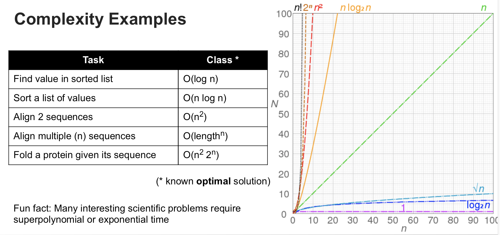

# Aim

This notebook goes over some basic concepts in data structures and algorithms. 
You should go through it and try to **answer the questions** before the 
"Introduction to Algorithms" tutorial. 
We will use time during the tutorial to clarify any confusions and do the exercises.

For a proper overview of such topics, there are plenty of free online courses 
on Coursera, Youtube, etc. Classic books in the area are:

- [Introduction to Algorithms](https://www.amazon.com/Introduction-Algorithms-3rd-MIT-Press/dp/0262033844) by Cormen et. al.
- [Algorithms](https://www.amazon.com/gp/product/032157351X/ref=as_li_qf_sp_asin_il_tl?ie=UTF8&tag=algs4-20&linkCode=as2&camp=1789&creative=9325&creativeASIN=032157351X) by Sedgewick and Wayne 

though note that these were written for computer science undergraduates and quickly get technical.


# Preliminaries

We'll be using the R programming language to discuss some algorithmic concepts.
R is perhaps not the best choice for introducing such topics, since it's a high-level
language, abstracting over many of the low-level operations.
Still, many of the concepts can be discussed at multiple levels and when writing
your own code it's good to be aware of the time and memory cost of your routines.

Click [here](intro_to_algos.Rmd) to **download this R notebook** 
so you can run it and write your own code.

# Basic Concepts

The whole point of programming is to automate tasks and let computers do the "heavy lifting" of processing.
Regardless of application area (bioinformatics, computer games, video streaming), 
the basic building blocks of programming are essentially the same and revolve around
**storing** and **processing** data. 
These two aspects are in a constant interplay and are tackled by
**data structures** and **algorithms**, respectively.
In fact, structure reflects function and no single data structure will best support all
types of processing.


# Basic Data Structures

## Atomic values and operations

Like their mathematical counterparts, variables are labels assigned to various values.
These values may be *atomic* (e.g. a number) or structured *collections* of atomic values 
(e.g. a vector of numbers):

```{r}
protein_count <- 2345                    # atomic value
organism <- "yeast"                      # string
temperatures <- c(35.2, 34, 35.7, 34.5)  # vector of floats (real values)

length(protein_count)
length(organism)
length(temperatures)
```

(Note: The length of `organism` is 1 since R treats strings as single values.
However, every time we perform some string manipulation operation (e.g. pattern matching),
these strings are processed character by character.)

The main thing to note here from an algorithmic point of view is:

> **We can measure a program's running time in terms of atomic operations**,
i.e. getting and setting atomic values, as well as arithmetic operations with these.

```{r}
# 1 atomic operation: assigning (setting) a value
protein_count <- 2345                          

# 3 atomic operations: 
# - getting the protein_count value from RAM into the CPU
# - adding an atomic value 
# - then setting the resulting adjusted_protein_count value from the CPU into RAM
adjusted_protein_count <- protein_count + 100 
```

This is our unit of time. Of course the exact number of milliseconds will differ between computers,
but this intrinsic unit allows us to reason about how the cost of programs scales with the amount of data they're fed.

And because the focus is how things scale, it turns out that we can also think about
the second operation above as effectively atomic, because constant multiplication factors
can be ignored. For now, don't worry about that or the whole CPU-RAM dynamic mentioned there.

The same reasoning in terms of atomic and compound values applies to **memory cost** 
though nowadays you're more likely to bump into long running times than memory limitations.


## Vectors

Also called *arrays* or *lists* in other languages, these are linear collections
of atomic values of the same type.

```{r}
temperatures <- c(35.2, 34, 35.7, 34.5)
```

Let's say the length of a vector is N.

> **One requires N atomic operations to fully process a vector**

The time cost (or "time complexity" as it's formally known) of a program is 
defined as a function of the size of the input. So if our input is N numbers 
collected in a vector, the time cost is `time_cost(N) = k * N`

As I hinted two examples ago, `k` can be theoretically ignored. This has more to do
with the fact that as N grows to larger and larger values, some programs will
have a time cost of e.g `k * N` and others of e.g. `k * N * N` (N squared).
When comparing such programs, the constants really don't matter and it's the power of N
that "dominates" the time cost.
But of course, in practice, if you can reduce the k from 10 to 1, and N is the number of days, that does indeed make a difference.

Back to vectors: they are meant for storing and fetching values by position.
As in, assuming you "know" which element you want, 
you can retrieve it in one atomic operation (or "constant time").

```{r}
temperatures[4]  # 1 atomic operation: getting the value
```

This is important to understand. If you want element number 1000 from a vector, 
the computer directly gives you that element (in 1 atomic operation),
it doesn't cross the entire list to get there.

Now, the problem is if you *don't know* which element you want, say if you're
looking for the largest value. If you're just given a vector and know nothing
about it, you really have no choice but to go element-by-element to find the
largest one. Thus, computing `max(vector)` has a time cost of `N`.

> One often thinks of program **time costs** in terms of **worst-case scenarios**,
since these cases will inform how many resources must be guaranteed for the program.

Many real world problems are intrinsically difficult, 
meaning the optimal solution requires very large time costs.
The figure below gives a few examples.
`O()` basically means worst case. As you can see, for some of these 
the cost explodes even with relatively few data (N)




## Hash Maps

Also known as "dictionaries" (Python), "hash tables", 
or "associative array" (in the theory),
this data type holds a collection of elements, similar to a vector,
except that elements are indexed by *keys* (unique IDs) and are not sorted in any particular order.
These keys can be of any data type, though frequently strings are used.
Indeed, vectors can be considered a particular case of hash map, where the keys are
successive integers.

They are often used for "reversed lookup" scenarios.
So for instance, if you want to look up the coordinates of a gene,
you can use a hash map indexed by gene name to fetch the associated numeric value.
With hash maps, this is an atomic operation (i.e. the list of keys is not searched until the 
matching one is found).

R does not include an explicit hash map structure in the base language.
However, it's possible to simulate it using R's *environments*. 
For this purpose, we can think of these as "bags" of variables.
The fact that they can be used as hash maps is incidental
and may not work this way for really old versions of R.
For more details, see [this post](https://riptutorial.com/r/example/18339/environments-as-hash-maps).


```{r}
gene_pos <- new.env(hash = TRUE)

# We insert elements one by one using gene names as string keys
# The syntax is 
# hashmap[[key]] <- value   Note the double brackets

gene_pos[["gene_a"]] <- c(1, 1000)
gene_pos[["gene_b"]] <- c(10001, 2010)
gene_pos[["gene_c"]] <- c(2011, 2999)
```

To retrieve an element from this hash map using a gene name (the key), simply
refer to it like this

```{r}
gene_pos[["gene_b"]]
```

To get a list of keys, inspect the names in the hashmap:

```{r}
names(gene_pos)
```

If a key is not present, `NULL` is returned. 
The proper way to check that is with the `is.null()` command:

```{r}
query_gene = "gene_x"

if (is.null(gene_pos[[query_gene]])) {
    print("Gene not preset")
} else {
    gene_pos[[query_gene]] 
}
```

Why is this a useful data structure? Because

> **Entries in hash maps are accessed in one atomic operation**


### Question 1

**How would you perform this look up using vectors?** That is, 
given vectors `gene_start <- c(100, 200, ...)` and 
`gene_name <- c("gene_a", "gene_b", ...) `, how would you fetch the start position
of a query gene?


## Sets

In many languages, a "set" data structure is simply a "bag" of values (like a vector,
but without any ordering). The great advantage is that they can tell you
in a single atomic operation if a value is present or not in the set.

> **Testing set membership takes a single atomic operation**

Which is great if you're testing whether a million values are part of a set containing 
10 million known values.

Unfortunately R doesn't have these natively, though there are packages available.
In the spirit of "do more with less" (and to avoid installing extra crap),
we can simulate these as well with environments.


```{r}
gene_id_set <- new.env(hash = T)

gene_id_set[["AB1234"]] <- T   # Really, any value except NULL
gene_id_set[["AB1235"]] <- T
gene_id_set[["AB1236"]] <- T

query_gene = "XY1234"

if (is.null(gene_id_set[[query_gene]])) {
    print("Gene not preset")
} else {
    gene_id_set[[query_gene]] 
}
```

To "remove" a value from the set, set it to `NULL`

```{r}
gene_id_set[["AB1235"]] <- NULL
```


# Control Flow

Programs usually consist of collections of tasks that are applied repetitively
to multiple input values, or are applied conditionally based on some logic.
Technically, this is called *control flow* and the basic patterns one must know are
*loops* and logical execution *conditions*. 
These are likely familiar to any beginner programmer but here we will focus more
on algorithmic aspects.

## Looping

The most typical pattern is to apply some sort of processing to many elements in a loop. 

```{r}
CELSIUS_ZERO_IN_KELVIN <- 273.15

# empty vector of same length as temperatures
temperatures_kelvin <- rep(0.0, length(temperatures))

for  (i in 1:length(temperatures)) {
    temperatures_kelvin[i] <- CELSIUS_ZERO_IN_KELVIN + temperatures[i]
}
temperatures_kelvin
```

Before we move on, please note that we **do not change the input data** and instead
create a new vector for the transformed vales.
This is a **good practice** that you should follow, primarily for reproducibility reasons.

Here we applied a simple transformation to all elements of a unidimensional vector.
Suppose we have a list of lists or a matrix, and we need to change all elements,
say get log values of protein counts across samples.

```{r}
N_PROTEINS <- 3
N_SAMPLES <- 4

protein_counts_across_samples <- matrix(
    c(
        c(100, 121, 10, 15),
        c(1000, 1337, 175, 165),
        c(100, 121, 10, 15)
    ),
    nrow = N_PROTEINS, ncol = N_SAMPLES
)

protein_log_counts_across_samples <- matrix(0, nrow = N_PROTEINS, ncol = N_SAMPLES)

for (protein_num in 1:N_PROTEINS) {
    for (sample_num in 1:N_SAMPLES) {
        protein_log_counts_across_samples[protein_num, sample_num] <-
            log(protein_counts_across_samples[protein_num, sample_num])
    }
} 

protein_log_counts_across_samples
```

### Question 2

**What is the time cost of the matrix transformation above?** Try to phrase your answer as a formula, not actual numbers.


Now, the above is only for illustration.
Since R is a high-level language with built-in vectorized operations,
you don't need to do any of that in actual code. You'd simply write:

```{r}
temperatures_kelvin <- temperatures + CELSIUS_ZERO_IN_KELVIN
protein_log_counts_across_samples <- log(protein_counts_across_samples)
```

In fact, `for` loops in R tend to be slower than these vectorized operations 
(i.e. operations/functions that can be applied on the vectors as a whole).
Though keep in mind that "under the hood", it's still for loops!
(Just in C or Fortran and hence much faster).

`for` loops still need to be used in same cases, but there are better patterns to use.


## Functional Approach

As with any technological process or pipeline, 
certain functionality can be made generic and reused. 
In R, procedures can be encapsulated in functions.


For example, let's have a function that truncates any negative value to 0 and
doubles any positive value. Why not.

```{r}
amplify_positive <- function(value) {
    # The value of the last executed command is the value the function gives back
    # One can also be explicit and use the return() command for clarity
    
    if (value < 0) {
        return(0)
    } else {
        return(2 * value)
    }
}
```

R is a functional language which means functions "play well" with the various
data structures. Quite often in statistical, mathematical, and bioinformatical programming, 
one works with vectors as the unit of calculation and the focus is more on the functions 
that are applied to these vectors. 
Functional programming is a very deep subject area but it helps to be aware of some common patterns.
For more info, see the [chapter](https://adv-r.hadley.nz/fp.html) in *Advanced R*.

Here we will look at two common functional operations:

- **map** aka **apply**  (the former name is the most common and the one used in the 
[theory](https://en.wikipedia.org/wiki/Map_(higher-order_function)))
- **filter**
- **reduce** aka **summarize** aka **combine** aka **fold** 

### Map

This basically means *applying a function to each element* in a vector.
In base R this operation is called `apply` (and exists in several version).

Because our example function has a logical test that is defined per atomic value,
it cannot simply be fed an entire vector (like we did for the `log` function).
The code below will given a warning and not produce what we want.

```{r}
test_values <- c(-3, -2, -1, 0, 1, 2, 3) 
amplify_positive(test_values)
```

So we must tell R how to map the function onto a vector (or "apply" it).
There are a few version of this function and you are encouraged to read the vignette
and try these out. The basic syntax is

```
lapply(vector, function)     # "l" is for "list"-ify the output
sapply(vector, function)     # "s" for simplify output
``` 

```{r}
test_values <- c(-3, -2, -1, 0, 1, 2, 3) 
sapply(test_values, amplify_positive)
```

The `lapply` version wraps each transformed value in the vector in a list.
This looks weird but it's sometimes required depending on how downstream functions work.

```{r}
lapply(test_values, amplify_positive)
```

Fun fact: the `dplyr` pipe operator `%>%` is a type of map operation, just
written as a "connector" that has the meaning `data %>% function == function(data)`.

If you can (easily) express a procedure as a function, the functional approach
is strongly encouraged instead of using `for` loops. So **don't write**

```{r}
amplified_values <- rep(0, length(test_values))
for (i in 1:length(test_values)) {
    if (test_values[i] < 0) {
        amplified_values[i] <- 0
    } else {
        amplified_values[i] <- 2 * test_values[i]
    }
}
```

Of course, "under the hood"

> **Mapping a function onto a vector still has a time cost of N (the length of the vector).**


### Filter

This pattern uses a logical condition function to choose only elements 
from a vector that satisfy the function's condition.
In base R (without extra packages like `dplyr` or `purrr`), 
this can be done in 2 steps: 
1) map the condition function onto the vector
to produce a logical (true/false) vector 
2) use R's [logical subsetting](https://adv-r.hadley.nz/subsetting.html#selecting-rows-based-on-a-condition-logical-subsetting) of a vector
to select only those elements that are marked with `TRUE`

In a single command, this would be `vector[apply(vector, condition)]`

We'll use a non-trivial toy example, where we're given a vector of query values
and wish to keep only "interesting" values above a threshold.

```{r}
baseline_values <- 1:8
interesting_values <- c(10, 100, 1337, 1e6)

is_interesting <- function(value) {
    if (value > max(baseline_values)) {
        for (element in interesting_values) {
            if (element == value) {
                # Match found: the function can immediately return TRUE
                return(TRUE)
            }
        }
        # If we went through all interesting_values without a match
        return(FALSE)
    } else {
        # The value was not above the baseline 
        return(FALSE)
    }
}

query_values <- 1:2000

query_values[sapply(query_values, is_interesting)]
```

Again, real R code, especially using `dplyr` and its friends, will look much
simpler. The point here is awareness of the steps involved, often "hidden" inside
various functions.

#### Question 3

> **What's the time cost of the example filter function?** Try to express it as a formula.

#### Question 4

> **How can you speed up this example filtering?** Hint: There are 2 ways and they involve `baseline_values` and `interesting_values`


### Reduce

This means *applying on a vector a function* that somehow combines the elements 
into a single (or at least lower-dimensional) value. 

The classic example is `sum()` which returns a single number, given a vector as argument.
Pretty straightforward, but good to be aware of it formally when designing your programs.

#### Question 5

**What's the time cost of reduce functions?** Try to express it as a formula.


### Map-Reduce

This is a frequent combination in data science and baked into the `dplyr` package,
as well as the overall `tidyverse` ecosystem.
In tidy data frames, columns are variables and rows observations.
Many operations performed can be expressed using map-reduce patterns.

For example, let's take the Iris dataset, and compute the average petal area.
The data frame looks like this

```{r}
iris
```
We compute the areas (very simplistically), then the average of all areas:

```{r, message=F, warning=F}
library(tidyverse)

iris %>% 
    dplyr::mutate(Petal.Area = Petal.Length * Petal.Width) %>% 
    dplyr::summarise(mean(Petal.Width))
```
The `mutate` function maps the multiplication (of two columns) onto the data frame,
then `summarize` performs a reduction to a single value, using the `mean` function.

#### Question 6

**What is the time cost of the above calculation?** Try to express it as a formula.

Using such patterns often makes code easier to understand and faster to write, 
and may even lead to faster execution if the system is optimized for functional 
or vector-based programming.

We will not cover parallelized code but another huge advantage is that this sort
of pattern is very easy run on multiple CPUs, leading to manifold speed improvements.
Indeed, many big data, machine learning, and bioinformatics frameworks automatically
do that for you, provided you structure the code this way.


# Testing Algorithms

We've looked at it different data structures and ways to control the flow of program execution. 
These are the building blocks of algorithms.
Besides time cost, another major concern when considering algorithms is **correctness**.
Even if one is developing a probabilistic or approximate algorithm,
it's important to verify that results are within acceptable bounds.

Many fundamental algorithms have rigorous mathematical proofs of correctness,
that take into account all possible inputs. In common practice,
it's very difficult to guarantee that any non-trivial algorithm produces the results you want
(provided of course you even explicitly *know* what you want). 
This is complicated by the fact that the *implementation* of an algorithm 
using a certain language, library, OS, etc. can hide a plethora of bugs.

Testing correctness of programs is a vast field, however

> **Using a few good practices will get you a long way toward correct and reproducible
code.**


## Toward correctness: Clean, modular code

Here are just two of these good programming practices.
It's very easy to pick up bad habits and hard to lose them so make sure to practice
these principles from the beginning :)

### (C1) Give meaningful names to variables and functions

Remember the rant about giving variables meaningful names? 
The pragmatic side of it is that you need to communicate what your code does. 
People (even future you) will evaluate code to see if it makes sense 
and does what it's supposed to. 
The flipside is that people won't trust your code if it looks like spaghetti.


### (C2) Don't repeat yourself

It's very tempting to copy-paste code to do the same thing mulitple times.
We've all done it. It's also a very bad idea.
It creates a "code swamp" that hides the main flow of the code but more importantly, 
it's highly error-prone, especially when making changes.
And changes will be made. There's no such thing as 100% single-use code.

So instead of something like this:

```r
data1 <- read_csv("my_data_file_1.csv")
avg1 <- mean(data1)
data2 <- read("my_data_file_2.csv")
avg2 <- mean(data2)
data2 <-read("my_data_file_3.csv")  # this copy-paste-change error is on purpose, but it happens
avg3 <- mean(data2)
````

Generalize:

```python
filenames <- c("my_data_file_1.csv", "my_data_file_2.csv", "my_data_file_3.csv")
averages <-
    sapply(
        sapply(filenames, read_csv),
        mean
    )
```

Now you can just extend the list of file names, or use `list.files()`
to get all files names in the directory. And if you ever want to summarize
the values differently, you just replace `mean` in one place.

If the benefit of the general form is not obvious, 
imagine the procedure for each file is like 20 lines long.

Of course, you need not (or can not) think up the best code structure beforehand, 
but do take steps to avoid bad patterns.


### Toward correctness: Testing

The most obvious way to test code is to feed it input and see if it produces expected output.
It's very difficult or even impossible to cover all cases,
especially if one is not aware of all corner cases of more complex code. 
But this can be alleviated by writing your programs in a modular way
and testing each "module" separately. This is easier if one follows principle (C2) above.

A **good practice** is to actually **prepare test cases before writing the code**. 
This helps thinking a bit deeper about the problem being solved and potential gotchas.

This can be as simple as writing something like:

```{r}
my_procedure <- function(x) { x^2 * 10 }

# Tests
test_inputs <- c(1, 2, 3, -1, -2)
expected_outputs <- c(10, 40, 90, 10, 40)

actual_outputs <- sapply(test_inputs, my_procedure)
all(expected_outputs == actual_outputs)
```

There is also a package called [testthat](https://testthat.r-lib.org/) which
offers more functionality for writing tests but as you can see, it's super easy
to write large batteries of tests to assess whehter you have the solution you think you have.


# Exercise: ID Frequency

1. Write a **function** that counts the number of times an ID appears in a vector.
E.g. in `c("abc", "xyz", "abc", "def")`, "abc" appears 2 times, the rest 1 time.

2. Describe its time cost using a formula. Aim for a low time cost when building your solution.

A solution written in every-day R is given below, for you to test against.
Please write the function using only base R ("from scratch") using the
data structures and methods discussed earlier.

Run the code below to generate 10 thousand random IDs consisting of 2 letters
and a digit, then write your function and test it against the solution written below.

```{r}
library(stringi)
random_strings <- do.call(paste0, Map(stri_rand_strings, n=1e4, length=c(2, 1),
                          pattern = c('[A-Z]', '[0-9]')))
```

```{r}
# Your function here 
```

```{r}
answer <- 
    as_tibble(random_strings) %>% 
    rename(id = value) %>% 
    group_by(id) %>% 
    count()

answer
```
